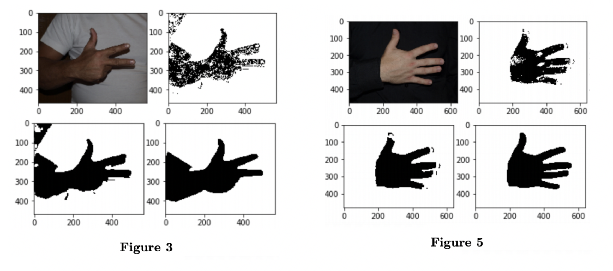

### Skin detection and Finger classification

Image Processing and Artificial Vision, GCiED

Alex Carrillo and Robert Tura

-May 22, 2020, *Universitat Politècnica de Catalunya*

> *Introduction*. The purpose of this report is to show an approach of using bidimensional histogram information of images in some color spaces to extract which regions of a picture contain human skin, and we also present which processing steps improve these predictions. Furthermore, we explain our idea on finger classification of those segmented images, i.e. how many fingers are shown, and we expose the results obtained, the difficulties and further work.

------

### Contents

1. **Introduction**
2. **Color spaces**
   1. RGB (and RG)
   2. HSV - Hue Saturation Value
   3. YCbCr - Luminance Chrominance
3. **Reasoning of the approach**
   1. Skin detection
   2. Finger classification
4. **Performance**
   1. Skin detection
   2. Finger classification
5. **Results**
6. **Parameter sensitivity**
7. **Further improvements**
8. **Conclusions**
9. **References**

